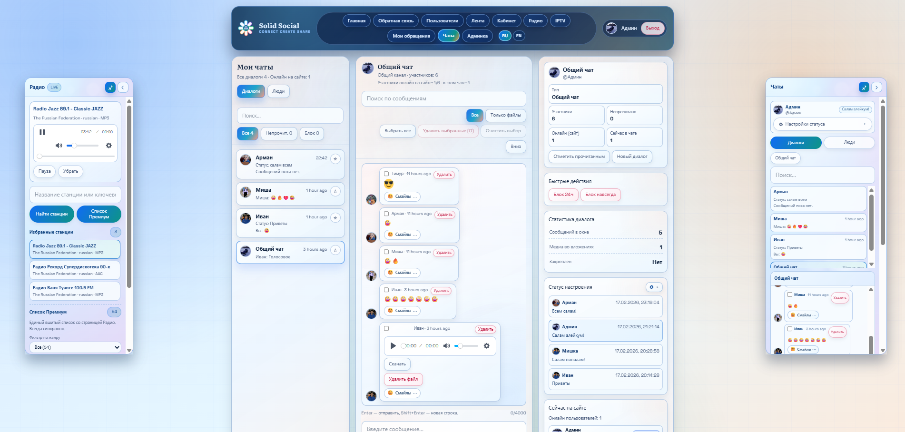
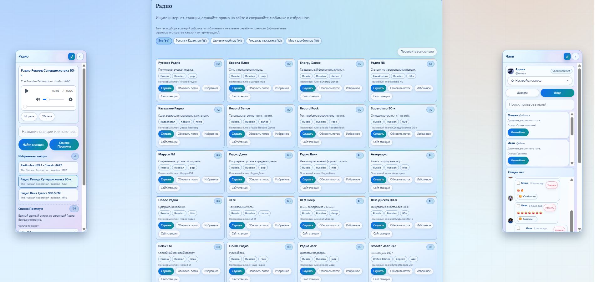
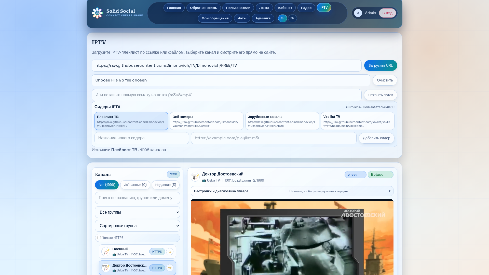
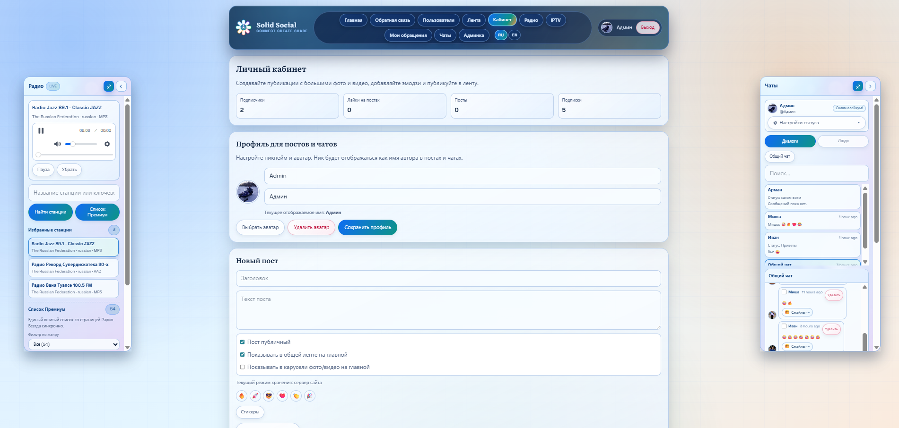
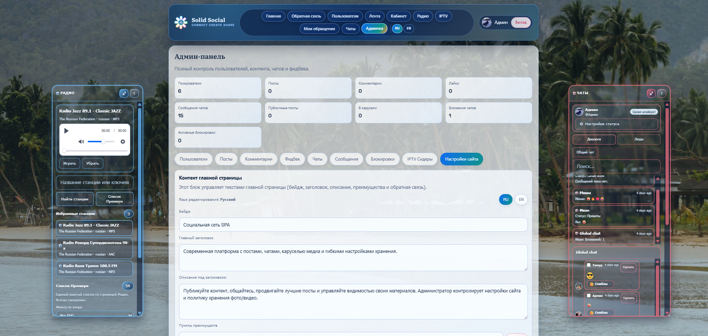

# Solid Social Network SPA URALSK + IPTV/Radio

SPA-социальная сеть на `Laravel + Vue` с realtime-чатами, медиа-лентой, интернет-радио, IPTV и административным кабинетом.

**Автор проекта:** Rinat Sarmuldin  
**Email:** [ura07srr@gmail.com](mailto:ura07srr@gmail.com)

> IPTV/Radio: используются открытые источники. Ответственность за соблюдение прав на конкретные потоки лежит на пользователе/владельце инстанса.

## Содержание
- [О проекте](#о-проекте)
- [Ключевая функциональность](#ключевая-функциональность)
- [Скриншоты интерфейса](#скриншоты-интерфейса)
- [Архитектура](#архитектура)
- [Безопасность](#безопасность)
- [Технологический стек](#технологический-стек)
- [Быстрый старт](#быстрый-старт)
- [Переменные окружения](#переменные-окружения)
- [Тестирование](#тестирование)
- [API ориентиры](#api-ориентиры)
- [Swagger / OpenAPI](#swagger--openapi)
- [Тестовые аккаунты](#тестовые-аккаунты)
- [Частые проблемы](#частые-проблемы)
- [Деплой в production](#деплой-в-production)
- [Лицензия и права использования](#лицензия-и-права-использования)

## О проекте
`Solid Social` объединяет классический social feed и realtime-взаимодействие с мультимедийными сценариями:
- социальные публикации с медиа, комментариями, репостами и лайками;
- realtime-чаты с presence-статусами и typing-индикаторами;
- радио и IPTV-плеер (direct/proxy/transcode/relay режимы);
- админ-панель для модерации и настройки контента;
- мультиязычный интерфейс `RU/EN` с SEO URL (`/ru/...`, `/en/...`).

## Ключевая функциональность

### Социальная часть
- Регистрация, вход, подтверждение email.
- Профиль пользователя, подписки, лента подписок.
- Посты, комментарии, лайки, репосты, просмотры.
- Загрузка медиа и выдача через отдельные API-эндпоинты.

### Realtime и чаты
- Личные и общие диалоги.
- Presence: кто онлайн на сайте и в конкретном чате.
- Typing indicator через `whisper`.
- Статусы настроения с настройкой видимости (для всех или скрытие от выбранных участников).
- Архивирование/восстановление чатов, реакции, вложения.
- Удаление сообщений/вложений автором и администратором (через API), синхронизация между страницей чатов и виджетом.
- Транспорт realtime: `Laravel Reverb` + `pusher` protocol.

### IPTV
- Импорт плейлиста по URL (`m3u/m3u8`) и пользовательские сидеры.
- Фильтрация каналов по имени/группе, избранное, recent.
- Режимы воспроизведения:
  - `Direct` (прямой поток),
  - `Proxy` (серверный прокси для обхода CORS),
  - `Compatibility/Transcode` (FFmpeg HLS-подготовка),
  - `Relay` (ретрансляция с минимальной обработкой).
- Автоочистка и остановка серверных сессий при уходе со страницы.

### Радио
- Поиск станций через Radio Browser API.
- Встроенные подборки станций по категориям с проверкой доступности потоков.
- Блок "Сейчас играет" со статусом воспроизведения, временем сессии и метаданными станции.
- Избранные станции пользователя с мини-контролом текущего трека (play/pause/seek для не-live потоков).
- Одноразовая команда распределения избранного админов всем не-админам: `php artisan radio:distribute-admin-favorites` (`--dry-run` для проверки).

### Главная страница и контент
- Медиа-карусель.
- Виджет времени и погоды для городов (Нью-Йорк, Москва, Минск, Астана, Анкара, Уральск).
- Источник погоды: `Open-Meteo` через серверный запрос.
- В админке редактирование контента главной отдельно для `RU` и `EN`.

### Мультиязычность и SEO
- Локализованные роуты: `/ru/...` и `/en/...`.
- Автоматический редирект на язык, если префикс не указан.
- Хранение выбранного языка в `localStorage` (`solid-social:locale`).
- Поддержка runtime-перевода legacy-строк.

## Скриншоты интерфейса

Актуальная галерея интерфейса. Нажмите на изображение, чтобы открыть полный размер.

<table>
  <tr>
    <td align="center" width="33%">
      <a href="docs/screenshots/home-feed.png" target="_blank" rel="noopener noreferrer">
        
      </a>
      <br>
      <sub><b>Главная / лента</b></sub>
    </td>
    <td align="center" width="33%">
      <a href="docs/screenshots/chat-page.png" target="_blank" rel="noopener noreferrer">
        
      </a>
      <br>
      <sub><b>Чаты</b></sub>
    </td>
    <td align="center" width="33%">
      <a href="docs/screenshots/radio.png" target="_blank" rel="noopener noreferrer">
        
      </a>
      <br>
      <sub><b>Радио</b></sub>
    </td>
  </tr>
  <tr>
    <td align="center" width="33%">
      <a href="docs/screenshots/iptv-playing.png" target="_blank" rel="noopener noreferrer">
        
      </a>
      <br>
      <sub><b>IPTV</b></sub>
    </td>
    <td align="center" width="33%">
      <a href="docs/screenshots/cabinet.png" target="_blank" rel="noopener noreferrer">
        
      </a>
      <br>
      <sub><b>Кабинет пользователя</b></sub>
    </td>
    <td align="center" width="33%">
      <a href="docs/screenshots/admin-settings.png" target="_blank" rel="noopener noreferrer">
        
      </a>
      <br>
      <sub><b>Админ-панель</b></sub>
    </td>
  </tr>
  <tr>
    <td colspan="3" align="center">
      <sub>Скриншоты открываются в новой вкладке — вернуться можно, просто закрыв её.</sub>
    </td>
  </tr>
</table>

Каталог со скриншотами: `docs/screenshots/`.

## Карта модулей
| Модуль | Назначение | Точка входа |
|---|---|---|
| Auth + профиль | Регистрация, вход, подтверждение email, кабинет | `routes/web.php`, `routes/api.php` |
| Feed / posts | Публикации, лайки, комментарии, репосты, discover | `app/Http/Controllers/PostController.php` |
| Realtime chat | Диалоги, presence, typing, вложения, архивы | `app/Http/Controllers/ChatController.php`, `routes/channels.php` |
| IPTV | Загрузка плейлистов, proxy/transcode/relay сессии | `app/Http/Controllers/IptvController.php`, `app/Services/Iptv*` |
| Radio | Поиск, подборки, воспроизведение, избранное и их распределение | `app/Http/Controllers/RadioController.php`, `app/Console/Commands/DistributeAdminRadioFavorites.php` |
| Админка | Модерация пользователей/контента/обращений, настройки сайта | `/api/admin/*`, `app/Http/Controllers/AdminController.php` |
| Контент главной | RU/EN контент, world overview (время/погода) | `app/Http/Controllers/SiteSettingController.php`, `app/Services/WorldOverviewService.php` |
| i18n + SEO | RU/EN маршруты, runtime перевод, SEO мета | `resources/js/router/index.js`, `resources/js/i18n` |

## Архитектура

### Схема компонентов
```mermaid
flowchart LR
    U[Browser / Vue SPA] -->|HTTP API + Cookie Session + CSRF| N[Nginx]
    U -->|WebSocket (Pusher protocol)| R[Laravel Reverb :6001]
    N --> A[Laravel API / PHP-FPM]
    A --> DB[(MySQL 8.4)]
    A --> F[FFmpeg]
    A --> WM[Open-Meteo API]
    A --> RB[Radio Browser API]
    A <--> R
```

### Слои приложения
- **Frontend (Vue 3 SPA):**
  - роутер: `resources/js/router/index.js`
  - представления: `resources/js/views`
  - i18n: `resources/js/i18n`
- **Backend (Laravel 10):**
  - HTTP API: `routes/api.php`
  - web/shell: `routes/web.php`
  - broadcast channels: `routes/channels.php`
  - бизнес-логика: `app/Services`
  - валидация/безопасность: `app/Rules`, `app/Http/Middleware`
- **Realtime:** `Laravel Reverb` (сервис `websocket` в Docker).
- **Storage/DB:** MySQL + файловое хранилище `storage`.

### Ключевые директории
```text
app/
  Http/
  Services/
  Events/
  Rules/
resources/js/
  views/
  components/
  router/
  i18n/
routes/
tests/Feature/
docker/
```

## Безопасность

### Аутентификация и доступ
- `Laravel Sanctum` в stateful-cookie режиме (`EnsureFrontendRequestsAreStateful`).
- Основные API сгруппированы под `auth:sanctum` + `verified` (подтвержденный email).
- Админские маршруты защищены middleware `admin` (`EnsureUserIsAdmin`).
- Broadcast-каналы имеют явную авторизацию в `routes/channels.php`.

### CSRF / Cookies / CORS
- CSRF защита включена для web-запросов.
- XSRF cookie name вынесен в env (`XSRF_COOKIE`), чтобы не конфликтовать между local и Docker.
- Сессионный cookie name тоже разделен (`SESSION_COOKIE`).
- CORS ограничен списком `CORS_ALLOWED_ORIGINS`, credentials включены.

### Валидация входных данных
- Запросы покрыты FormRequest/валидацией.
- Правило `NoUnsafeMarkup` блокирует:
  - HTML-теги,
  - encoded-теги (`&lt;...&gt;`),
  - `javascript:` / `vbscript:` / inline handlers,
  - скрытые управляющие символы.
- Для IPTV URL действует фильтрация:
  - только `http/https`,
  - блок private/reserved IP и `localhost`.

### Ограничение нагрузки
- Глобальный API rate limit: `60` запросов/минута на пользователя/IP.
- Отправка email verification notification: `throttle:6,1`.
- IPTV сессии ограничены по количеству и TTL (proxy/transcode).

## Технологический стек
- **Backend:** PHP `^8.2` (Docker: PHP 8.3), Laravel 10, Sanctum, Reverb.
- **Frontend:** Vue 3, Vue Router, Axios, Vite 7, Tailwind CSS 4.
- **Media/Streaming:** HLS.js, DASH.js, MPEGTS.js, Plyr, FFmpeg.
- **Database:** MySQL (Docker: `mysql:8.4`).
- **Infra:** Docker Compose (Nginx + PHP-FPM + Reverb + MySQL + Node profiles).

## Быстрый старт

### 1) Локальный режим (без Docker)
1. Установите зависимости:
   - `composer install`
   - `npm ci`
2. Создайте `.env` из примера:
   - Linux/macOS: `cp .env.example .env`
   - PowerShell: `Copy-Item .env.example .env`
   - CMD: `copy .env.example .env`
3. Настройте подключение к БД в `.env`.
4. Выполните инициализацию:
   - `php artisan key:generate`
   - `php artisan migrate --seed` (или `php artisan db:seed --class=IptvSeedSeeder` для IPTV каналов)
   - `php artisan storage:link`
5. Запустите процессы:
   - `php artisan serve`
   - `npm run dev`
   - `php artisan reverb:start --host=0.0.0.0 --port=6001`
6. Откройте `http://127.0.0.1:8000`.

### 2) Docker режим
1. Запуск:
   - `docker compose up -d --build`
   - Если порты заняты, задайте forward-порты перед запуском (PowerShell):
     `$env:WEB_FORWARD_PORT=8081; $env:DB_FORWARD_PORT=3308; $env:VITE_FORWARD_PORT=5174; $env:REVERB_FORWARD_PORT=6002; docker compose up -d --build`
2. Проверка:
   - `docker compose ps`
   - `docker compose top websocket`
3. Откройте `http://localhost:8080`.

В Docker:
- миграции запускаются автоматически (`RUN_MIGRATIONS=1`);
- `ffmpeg` уже установлен в образе `app`;
- отдельный websocket сервис поднимает Reverb на `6001`.
- при первом запуске зависимости (`composer`/`npm`) могут ставиться несколько минут, это нормально.

### Полезные Docker команды
- Миграции вручную: `docker compose exec app php artisan migrate --seed`
- Сиды: `docker compose exec app php artisan db:seed`
- Наполнение IPTV каналов: `docker compose exec app php artisan db:seed --class=IptvSeedSeeder`
- Проверка раздачи радио-избранного админа: `docker compose exec app php artisan radio:distribute-admin-favorites --dry-run`
- Тесты: `docker compose --profile test run --rm test`
- Логи: `docker compose logs --tail=100 app`
- Остановка: `docker compose down`

### Docker порты и БД
- App: `http://localhost:8080` (переменная `WEB_FORWARD_PORT`)
- Vite dev (`profile dev`): `http://localhost:5173` (переменная `VITE_FORWARD_PORT`)
- Reverb websocket: `ws://localhost:6001` (переменная `REVERB_FORWARD_PORT`)
- MySQL с хоста: `127.0.0.1:3307` (переменная `DB_FORWARD_PORT`)
- MySQL внутри сети Docker: `db:3306`

## Переменные окружения

### Важно
- Локальный режим: используйте `.env` (из `.env.example`).
- Docker режим: сервисы используют `.env.docker.example`.
- Не смешивайте local и docker cookies/домены в одном браузерном контексте.

### Ключевые env-переменные
- Приложение: `APP_ENV`, `APP_DEBUG`, `APP_URL`
- База: `DB_CONNECTION`, `DB_HOST`, `DB_PORT`, `DB_DATABASE`, `DB_USERNAME`, `DB_PASSWORD`
- Безопасность/сессия: `SANCTUM_STATEFUL_DOMAINS`, `CORS_ALLOWED_ORIGINS`, `SESSION_COOKIE`, `XSRF_COOKIE`, `VITE_XSRF_COOKIE_NAME`
- Realtime: `REVERB_*`, `VITE_REVERB_*`
- IPTV: `IPTV_FFMPEG_BIN`
- Radio API: `RADIO_BROWSER_BASE_URL`
- Docker Compose (host only): `WEB_FORWARD_PORT`, `DB_FORWARD_PORT`, `VITE_FORWARD_PORT`, `REVERB_FORWARD_PORT`, `APP_HEALTHCHECK_START_PERIOD`, `RUN_MIGRATIONS`

## Тестирование
Локально:
- Все тесты: `php artisan test`
- Feature suite: `php artisan test --testsuite=Feature`
- IPTV: `php artisan test tests/Feature/IptvFeatureTest.php`
- IPTV Админка (Сидеры): `php artisan test tests/Feature/AdminIptvSeedFeatureTest.php`
- Чаты и realtime: `php artisan test tests/Feature/ChatFeatureTest.php`
- Broadcast channels: `php artisan test tests/Feature/BroadcastChannelsFeatureTest.php`
- Админка: `php artisan test tests/Feature/AdminPanelFeatureTest.php`
- Фронт-билд: `npm run build`

В Docker:
- Все тесты (одноразовый test-контейнер): `docker compose --profile test run --rm test`
- Все тесты (в запущенном app-контейнере): `docker compose exec app php artisan test`
- Feature suite: `docker compose exec app php artisan test --testsuite=Feature`
- Конкретный файл тестов: `docker compose exec app php artisan test tests/Feature/ChatFeatureTest.php`
- Фронт-билд: `docker compose run --rm frontend-build`

Рекомендуемый pre-commit check:
- `php artisan test`
- `npm run build`

## API ориентиры

### Публичные
- `POST /api/feedback`
- `GET /api/site/home-content`
- `GET /api/site/world-overview?locale=ru|en`

### Авторизованные + verified
- Чаты:
  - `GET /api/chats`, `GET /api/chats/unread-summary`, `GET /api/chats/users`
  - `POST /api/chats/direct/{user}`, `GET /api/chats/{conversation}`, `POST /api/chats/{conversation}/read`
  - `GET /api/chats/{conversation}/messages`, `POST /api/chats/{conversation}/messages`
  - `POST /api/chats/{conversation}/messages/{message}/reactions`
  - `DELETE /api/chats/{conversation}/messages/{message}`
  - `DELETE /api/chats/{conversation}/messages/{message}/attachments/{attachment}`
  - `GET /api/chats/settings`, `PATCH /api/chats/settings`
  - `GET /api/chats/archives`, `POST /api/chats/archives`, `GET /api/chats/archives/{archive}/download`, `POST /api/chats/archives/{archive}/restore`
  - `PATCH /api/chats/{conversation}/mood-status`
- Радио: `GET /api/radio/stations`, `GET /api/radio/favorites`, `POST /api/radio/favorites`, `DELETE /api/radio/favorites/{stationUuid}`
- IPTV библиотека и импорт: `POST /api/iptv/playlist/fetch`, `GET /api/iptv/saved`, `POST /api/iptv/saved/playlists`, `PATCH /api/iptv/saved/playlists/{playlistId}`, `DELETE /api/iptv/saved/playlists/{playlistId}`, `POST /api/iptv/saved/channels`, `PATCH /api/iptv/saved/channels/{channelId}`, `DELETE /api/iptv/saved/channels/{channelId}`
- `POST /api/iptv/proxy/start`, `DELETE /api/iptv/proxy/{session}`
- `POST /api/iptv/transcode/start`, `DELETE /api/iptv/transcode/{session}`
- `POST /api/iptv/relay/start`, `DELETE /api/iptv/relay/{session}`

### Админские (`/api/admin/*`)
- Пользователи, посты, комментарии, обращения, диалоги, блокировки, настройки сайта.

## Swagger / OpenAPI
- Swagger UI: `GET /api/documentation`
- OpenAPI JSON: `GET /docs/api-docs.json`
- Генерация документации: `php artisan l5-swagger:generate`
- Базовые аннотации: `app/OpenApi/OpenApiSpec.php`
- В актуальной спецификации покрыты ключевые user-chat и admin-chat эндпоинты (диалоги, сообщения, реакции, mood status, удаление, массовая очистка и модерация сообщений в админке).

## Тестовые аккаунты
Доступны после `php artisan db:seed`:
- `admin@example.com` / `password`
- `user1@example.com` / `password`
- `user2@example.com` / `password`
- `user3@example.com` / `password`
- `user4@example.com` / `password`
- `user5@example.com` / `password`

## Частые проблемы

### `SQLSTATE[HY000] [2002] Connection refused`
- Проверьте `DB_HOST`/`DB_PORT` в активном env-файле.
- В Docker MySQL доступен на `127.0.0.1:3307`.

### `Access denied`
- Проверьте `DB_USERNAME`/`DB_PASSWORD` и пользователя в MySQL.

### `ports are not available` / `bind ... already in use`
- Порт уже занят другим приложением.
- Запустите Docker с другими host-портами через переменные:
  `WEB_FORWARD_PORT`, `DB_FORWARD_PORT`, `VITE_FORWARD_PORT`, `REVERB_FORWARD_PORT`.

### Пустая страница / сломанный фронт
- Локально: запущен ли `npm run dev`.
- Docker: пересоберите фронт `docker compose run --rm frontend-build`.
- Сделайте `Ctrl+F5`.

### `403` на `/api/broadcasting/auth`
- Убедитесь, что пользователь авторизован.
- Проверьте домен/порт (`APP_URL`) и фактический URL браузера.
- Проверьте, что Reverb запущен.

### `CSRF token mismatch`
- Очистите cookie и обновите страницу (`Ctrl+F5`).
- Убедитесь, что не смешаны окружения:
  - local: `XSRF_COOKIE=social_network_local_xsrf`
  - Docker: `XSRF_COOKIE=social_network_docker_xsrf`
- После переключения режимов выполните logout и удалите старые cookies.

### Битая аватарка или файлы из `/storage` (локально)
- Исправление:
  - `php -r "if (is_link('public/storage')) unlink('public/storage');"`
  - `php artisan storage:link`

## Деплой в production
Подробный production-гайд (Ubuntu + Nginx + PHP-FPM + Supervisor):  
`DEPLOY.md`

## Лицензия и права использования
- `© 2026 Rinat Sarmuldin. All rights reserved.`
- Репозиторий распространяется по проприетарной лицензии: `LICENSE`.
- Без письменного разрешения автора запрещены:
  - использование в production и коммерческих проектах;
  - копирование, изменение, распространение и создание производных работ.
- Для получения прав на использование свяжитесь с автором: `ura07srr@gmail.com`.
